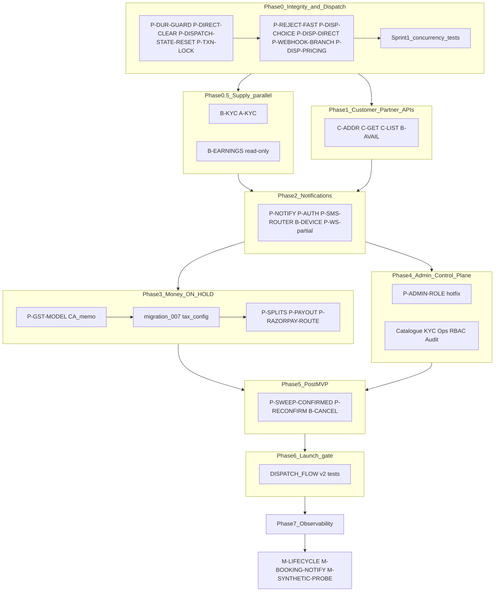

# Development plan — master index

**Not a second source of truth.** Normative behaviour lives in `spec/ARCHITECTURE.md`,
`spec/API_CONTRACTS.md`, `spec/DISPATCH_FLOW.md`, `spec/DATABASE.md`, and related
files. This folder tracks **sequence, status, and implementation tasks**.

When implementing a task: set **IN_PROGRESS** in `STATUS.md` when starting; set
**COMPLETED** (or **SKIPPED** with reason) in the same change when done. See
STATUS.md status vocabulary and phase dashboard.

---

## Spec documents (read first)

| Document | Role |
|---|---|
| [ARCHITECTURE.md](../ARCHITECTURE.md) | Stack, design rules, product policy |
| [API_CONTRACTS.md](../API_CONTRACTS.md) | Endpoints, error mapping |
| [DISPATCH_FLOW.md](../DISPATCH_FLOW.md) | Lifecycle, dispatch, races, launch-gate tests |
| [DATABASE.md](../DATABASE.md) | Migrations, money rules, constraints |
| [IDEMPOTENT_BOOKING.md](../IDEMPOTENT_BOOKING.md) | Duplicate-submit checkout |
| [STACK_VERSIONS.md](../STACK_VERSIONS.md) | Pinned versions |
| [OBSERVABILITY.md](../OBSERVABILITY.md) | Metrics, logs, alerts, lifecycle instrumentation (Phase 7) |
| [SPEC_AMENDMENTS.md](./SPEC_AMENDMENTS.md) | v3.2 additions + §21 launch policy + review disposition log |
| [LAUNCH_POLICY.md](./LAUNCH_POLICY.md) | **Puja MVP launch** vs Phase 2 — human-readable summary |

---

## Track files

| File | Audience |
|---|---|
| [PLATFORM.md](./PLATFORM.md) | Shared backend: workers, dispatch, money, infra |
| [A-TAX-CONFIG.md](./A-TAX-CONFIG.md) | Phase 3 tax admin API + migration 007 (commercial-only) |
| [CUSTOMER.md](./CUSTOMER.md) | Customer app API tasks |
| [PARTNER.md](./PARTNER.md) | Pujari (partner) app API tasks |
| [ADMIN.md](./ADMIN.md) | Admin control plane (Phase 4) — catalogue, ops, RBAC |
| [OBSERVABILITY.md](./OBSERVABILITY.md) | Phase 7 — metrics, logs, ops notifications, dashboards (**last**, post-app-design) |
| [STATUS.md](./STATUS.md) | **Implementation tracker** — COMPLETED / IN_PROGRESS / PENDING / BLOCKED / SKIPPED + phase dashboard |

---

## Product policy (launch decisions — not code bugs)

### Payment models

- **`full_online`** is the **default** checkout option in client UI (Urban Company /
  marketplace best practice). `advance_balance` is opt-in for customers who will
  not pay full amount online.
- **Commission base** = `amount_due_online` only (`payments.amount`). Platform fee,
  GST, and `payment_splits` never include the offline balance. See DATABASE.md.
- **`advance_balance` disintermediation risk:** mitigated at launch by **RM mediator**
  (no direct customer↔pujari phone). Phase 2: call masking (Exotel/Knowlarity).

### Marketplace launch risk

Supply (verified pujaris) is the constraint. **Phase 0.5** runs KYC + earnings
visibility in parallel with dispatch wiring — not after notifications.

### Puja MVP launch dispatch (July 2026 — SPEC_AMENDMENTS §21)

**Not a taxi/ride-hail clone.** Launch policy:

- **Broadcast only** — no “book this pujari” at checkout (direct disabled API/UI;
  DB constraints **kept**).
- **Citywide matching** — all eligible online verified pujaris; **no pujari GPS**.
- **Area dropdown** (`service_areas`) — display on offers only.
- **RM mediator** — customer and pujari coordinate via relationship manager; no
  direct phone exchange at launch.
- **Deferred dispatch** for advance bookings; short window for instant.
- **Mandatory reconfirmation** for advance (≥24h lead).
- **Payments:** keep `full_online` / `advance_balance` — no Razorpay auth/capture.
- **Festival surge:** ops/RM manual mitigation; automated waitlist Phase 2+.

See `spec/plans/LAUNCH_POLICY.md`.

---



| Phase | Goal | Exit gate |
|---|---|---|
| **0** | Integrity + dispatch wiring | P0 trio done; reject → rebroadcast &lt;2s; concurrency tests started |
| **0.5** | Real supply onboarding | KYC approve path works; earnings stub visible |
| **1** | Customer + partner CRUD gaps | Addresses, full booking detail, availability |
| **2** | SMS failover + FCM + devices | Backend code done; **live SMS = DLT registration**; **live FCM = Flutter app** |
| **3** | Money pipeline | **ON HOLD** until CA memo + Razorpay Route → migration 007, splits, TDS, payouts |
| **4** | Admin control plane | Ops run marketplace from UI — catalogue, KYC, search, reassign, RBAC, audit (**≠ go-live**) |
| **5** | Scheduled-booking ops | Pujari cancel, stuck-confirmed sweep (SPEC_AMENDMENTS) |
| **6** | Launch gate | DISPATCH_FLOW v2 concurrent tests automated |
| **7** | Observability & ops notifications | Lifecycle instrumentation, admin booking alerts, component health, Grafana, synthetic probe — **last** (post Flutter + admin UX freeze) |

See [`spec/OBSERVABILITY.md`](../OBSERVABILITY.md) and [`plans/OBSERVABILITY.md`](./OBSERVABILITY.md).

---

## Sprint 1 (this week) — Phase 0

**Order:** spec merge → concurrency test skeleton → integrity + dispatch code → tests green.

1. `P-DUR-GUARD` — migration 006 (duration NULLIF + CHECK)
2. `P-DIRECT-CLEAR-INTENDED` — dispatch-choice guarded UPDATE + enqueue broadcast
3. `P-DISPATCH-STATE-RESET` — worker `fresh=True` reset path
4. `P-TXN-LOCK` — guarded UPDATE audit on existing handlers
5. `P-REJECT-FAST` — `send_task(rebroadcast)` in offers reject path
6. `P-DISP-CHOICE` — `send_task(broadcast)` on dispatch-choice
7. `P-DISP-DIRECT` + `P-WEBHOOK-BRANCH` — direct vs broadcast enqueue
8. `P-DISP-PRICING` — `pujari_pricing` filter (not `pujari_pujas`)
9. Sprint 1 concurrency tests (see STATUS.md) — alongside steps 2–8, not after Phase 6

---

## Sprint 2 — Phase 2 (notifications)

**Order:** SMS router → auth OTP wire → FCM client → notifications worker → device endpoints → booking events publish.

1. `P-SMS-ROUTER` — `sms_router.py` + FAST2SMS + MSG91 clients; `SMS_PROVIDER_ORDER` failover
2. `P-AUTH` — `otp/request` via `sms_router`; response `sms_sent` + `sms_provider`
3. `P-NOTIFY` — Celery `notifications` queue: FCM retry + SMS fallback via `sms_router`
4. `B-DEVICE` — `POST/DELETE /v1/me/devices` for FCM targets (customer + pujari)
5. `P-WS` (partial) — `booking_events.py` publishes `status_changed` on payment + accept
6. **Exit verify (external deps):**
   - **SMS:** DLT entity + header + template approved on provider — mandatory even for test sends (SPEC_AMENDMENTS §18). Until then: `DEBUG=true` + `otp_dev_only`; do not treat DLT rejection as a backend integration failure.
   - **FCM:** End-to-end push after **Flutter** registers `device_token` — not a backend-only gate.
   - **Automated:** `pytest tests/test_sms_router.py tests/test_phase2_*.py`

Env defaults (SPEC_AMENDMENTS §17):

```bash
SMS_PROVIDER_ORDER=fast2sms,msg91
MSG91_ENABLED=false
FAST2SMS_API_KEY=<dev api key>
```

---

## Sprint 3 — Phase 3 (money / tax — documentation merged 2026-07-17)

**Gates before prod money:** (0) Razorpay Route confirmed · (1) CA memo → `advisor_signoff_ref` · (2) migration 007.

**Order:** Razorpay Route confirmation (ops) · migration 007 DDL · CA memo → statutory seed ·
quote/hold snapshot → `P-IGST` → `A-TAX-CONFIG` write → `P-SPLITS` → `P-TDS-393` → `P-PAYOUT`.

1. `P-RAZORPAY-ROUTE` — confirm split settlement with Razorpay (RBI; §15)
2. migration 007 — **DDL only** (`tax_*_config` tables + snapshot columns); statutory seed after memo
3. `C-ADDR` — `users.billing_state_code` (blocks `P-IGST`)
4. `C-QUOTE` / `C-HOLD` / `C-BOOK` — fee + config snapshot; Razorpay = `total_charged_online`
5. `A-TAX-CONFIG` — commercial POST only after statutory seed; statutory = migration + memo
6. `P-SPLITS` + `P-TDS-393` + `P-INVOICE-SERIES`
7. `P-PAYOUT` — after Route + splits

(`P-ADMIN-ROLE` moved to **Sprint 4-0** — not Phase 3.)

Normative detail: `GST_Withholding_Tax_Model_v1.2.pdf` + `A-TAX-CONFIG_spec.md` → SPEC_AMENDMENTS §16.

**Phase 3 is ON HOLD** until CA approves. Do not start checkout snapshot or payout code.

---

## Sprint 4 — Phase 4 (admin control plane)

**Phase 4 complete ≠ go-live.** Go-live still needs Phase 3 (legal money settlement).

**May run in parallel with:** Phase 2 remainder (`P-WS`), Phase 0.5 (`B-KYC`), Phase 3 prep
(Razorpay Route confirmation — ops, not code).

| Sprint | Content |
|---|---|
| **4-0 (hotfix)** | **Migration 009 ships here** (4-0 tasks need `refresh_jti`, `roles` seed, `admin_credentials`). Build order: `P-ADMIN-AUTH-FIX` (body `app_context` — closes the live hole, no migration needed) → migration 009 → `P-AUTH-FIX` (refresh jti + OTP lockout) → `P-ADMIN-SEED` (roles + bootstrap + enrolment token) → `P-ADMIN-ROLE` (issuance gate; **role check scoped to admin context only** — customers/pujaris have no `user_roles` rows) → `P-ADMIN-AUTH` (TOTP; admin refresh ≤ 1 day). Ship **before** more admin APIs. |
| **4A** | Next.js shell + production CORS origin, mutation audit on live admin endpoints (**COMPLETED**). Support refund-cap enforcement + PII-read audit → closed in **4C** (`A-REFUND`, `A-SEARCH`) |
| **4B** | Catalogue (`A-CAT-*`) + duration-increase warning, areas + deactivation guard, pujari pricing, KYC queue (doc-level approve) — **COMPLETED** *(backend + admin UI)* |
| **4C** | Ops (search, detail, reassign with `revoked`, disputes, refunds), promos, read-only money (`A-MONEY-READ`) — **COMPLETED** *(manual QA 2026-07-22)* |

Detail: `ADMIN.md`, `SPEC_AMENDMENTS.md` §19.

### Migration numbering (fixed — do not collide)

| # | Scope |
|---|---|
| **007** | Tax: `tax_statutory_config`, `tax_commercial_config`, booking/hold snapshot columns |
| **008** | `P-PLL-GEOM` — optional `pujari_live_location.geom` sync trigger |
| **009** | `admin_audit_log` + **`REVOKE UPDATE, DELETE FROM puja_app`** (guarded skip if role missing — dev only; **prod runbook requires `puja_app` before 009** + idempotent `scripts/apply_grants.sql` on every deploy) · also on `booking_status_history` · seed `('assignment','revoked','Revoked by admin')` · seed `roles` (`admin`, `support`) + first-admin bootstrap · `promo_codes` `CHECK (valid_until > valid_from)` · `auth_sessions.refresh_jti` (P-AUTH-FIX) · `admin_credentials` for P-ADMIN-AUTH (TOTP secret **encrypted**, not hashed) |
| **010** | Early 4B slice: `puja_categories.is_active` |
| **011** | **4B Wave-0:** catalogue content model (`puja_content_items`, `puja_media`, slugs, `display_order`, `price_max` CHECK, `upload_status`) — SPEC_AMENDMENTS §20.1; price resolver is code-only (§20.3) |

---

## Scorecard

**Use `STATUS.md` checkboxes as the live tracker** — fixed Done/Partial/Todo counts
drift as tasks are added (P0 integrity trio, `[-] BLOCKED` money items). Do not rely
on headline percentages.

Broadcast happy path verified via `scripts/manual_verify_session.py`. Automated tests:
Phase 0–2 suites green (`test_phase0_sprint1`, `test_phase1_apis`, `test_phase2_*`, `test_sms_router`).
Run `pytest tests/ -q` before release.

## What plans do NOT contain

- Stack changes (Celery → Kafka, etc.) — ARCHITECTURE.md is final for launch
- Flutter mobile apps — **API readiness only in this repo**; client work tracked as
  `IN_PROGRESS` in `STATUS.md` (`C-FLUTTER-CUSTOMER`, `P-FLUTTER-PARTNER`) — not started
- Next.js **admin** app — implemented in `admin_ui/` (Phase 4A/4B)
- Tasks without a spec citation (except items in SPEC_AMENDMENTS.md marked **approved**)
- A third Cursor plan file — use `SPEC_AMENDMENTS.md` review log + `STATUS.md` only
