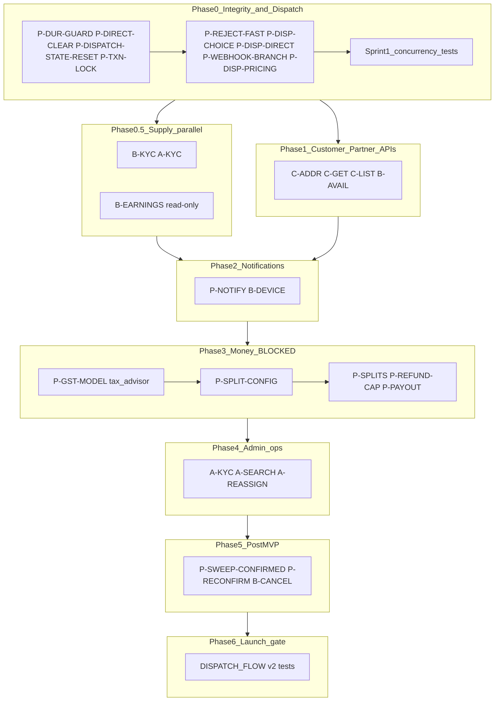

# Development plan — master index

**Not a second source of truth.** Normative behaviour lives in `spec/ARCHITECTURE.md`,
`spec/API_CONTRACTS.md`, `spec/DISPATCH_FLOW.md`, `spec/DATABASE.md`, and related
files. This folder tracks **sequence, status, and implementation tasks**.

When implementing a task: set **IN_PROGRESS** in `STATUS.md` when starting; set
**COMPLETED** (or **SKIPPED** with reason) in the same change when done. See
STATUS.md status vocabulary and phase dashboard.

---

## Spec documents (read first)

| Document | Role |
|---|---|
| [ARCHITECTURE.md](../ARCHITECTURE.md) | Stack, design rules, product policy |
| [API_CONTRACTS.md](../API_CONTRACTS.md) | Endpoints, error mapping |
| [DISPATCH_FLOW.md](../DISPATCH_FLOW.md) | Lifecycle, dispatch, races, launch-gate tests |
| [DATABASE.md](../DATABASE.md) | Migrations, money rules, constraints |
| [IDEMPOTENT_BOOKING.md](../IDEMPOTENT_BOOKING.md) | Duplicate-submit checkout |
| [STACK_VERSIONS.md](../STACK_VERSIONS.md) | Pinned versions |
| [SPEC_AMENDMENTS.md](./SPEC_AMENDMENTS.md) | v3.2 additions + review disposition log |

---

## Track files

| File | Audience |
|---|---|
| [PLATFORM.md](./PLATFORM.md) | Shared backend: workers, dispatch, money, infra |
| [CUSTOMER.md](./CUSTOMER.md) | Customer app API tasks |
| [PARTNER.md](./PARTNER.md) | Pujari (partner) app API tasks |
| [ADMIN.md](./ADMIN.md) | Admin panel API tasks |
| [STATUS.md](./STATUS.md) | **Implementation tracker** — COMPLETED / IN_PROGRESS / PENDING / BLOCKED / SKIPPED + phase dashboard |

---

## Product policy (launch decisions — not code bugs)

### Payment models

- **`full_online`** is the **default** checkout option in client UI (Urban Company /
  marketplace best practice). `advance_balance` is opt-in for customers who will
  not pay full amount online.
- **Commission base** = `amount_due_online` only (`payments.amount`). Platform fee,
  GST, and `payment_splits` never include the offline balance. See DATABASE.md.
- **`advance_balance` disintermediation risk:** high-relationship, low-frequency
  bookings (festivals, annual pujas) incentivise repeat off-platform contact after
  one job. Mitigate with product policy (default full_online, optional masked
  contact until en route — see SPEC_AMENDMENTS.md).

### Marketplace launch risk

Supply (verified pujaris) is the constraint. **Phase 0.5** runs KYC + earnings
visibility in parallel with dispatch wiring — not after notifications.

---

## Development phases

| Phase | Goal | Exit gate |
|---|---|---|
| **0** | Integrity + dispatch wiring | P0 trio done; reject → rebroadcast &lt;2s; concurrency tests started |
| **0.5** | Real supply onboarding | KYC approve path works; earnings stub visible |
| **1** | Customer + partner CRUD gaps | Addresses, full booking detail, availability |
| **2** | MSG91 + FCM | OTP SMS + offer push (poll remains safety net) |
| **3** | Money pipeline | **P-GST-MODEL signed off** → `payment_splits`, refund cap, payouts |
| **4** | Admin ops | Search, reassign, refund queue |
| **5** | Scheduled-booking ops | Pujari cancel, stuck-confirmed sweep (SPEC_AMENDMENTS) |
| **6** | Launch gate | DISPATCH_FLOW v2 concurrent tests automated |

---

## Sprint 1 (this week) — Phase 0

**Order:** spec merge → concurrency test skeleton → integrity + dispatch code → tests green.

1. `P-DUR-GUARD` — migration 006 (duration NULLIF + CHECK)
2. `P-DIRECT-CLEAR-INTENDED` — dispatch-choice guarded UPDATE + enqueue broadcast
3. `P-DISPATCH-STATE-RESET` — worker `fresh=True` reset path
4. `P-TXN-LOCK` — guarded UPDATE audit on existing handlers
5. `P-REJECT-FAST` — `send_task(rebroadcast)` in offers reject path
6. `P-DISP-CHOICE` — `send_task(broadcast)` on dispatch-choice
7. `P-DISP-DIRECT` + `P-WEBHOOK-BRANCH` — direct vs broadcast enqueue
8. `P-DISP-PRICING` — `pujari_pricing` filter (not `pujari_pujas`)
9. Sprint 1 concurrency tests (see STATUS.md) — alongside steps 2–8, not after Phase 6

---

## Scorecard

**Use `STATUS.md` checkboxes as the live tracker** — fixed Done/Partial/Todo counts
drift as tasks are added (P0 integrity trio, `[-] BLOCKED` money items). Do not rely
on headline percentages.

Broadcast happy path verified via `scripts/manual_verify_session.py`. Automated tests: 8/8 (`pytest tests/`).

---

## What plans do NOT contain

- Stack changes (Celery → Kafka, etc.) — ARCHITECTURE.md is final for launch
- Flutter / Next.js app implementation — API readiness only
- Tasks without a spec citation (except items in SPEC_AMENDMENTS.md marked **approved**)
- A third Cursor plan file — use `SPEC_AMENDMENTS.md` review log + `STATUS.md` only
