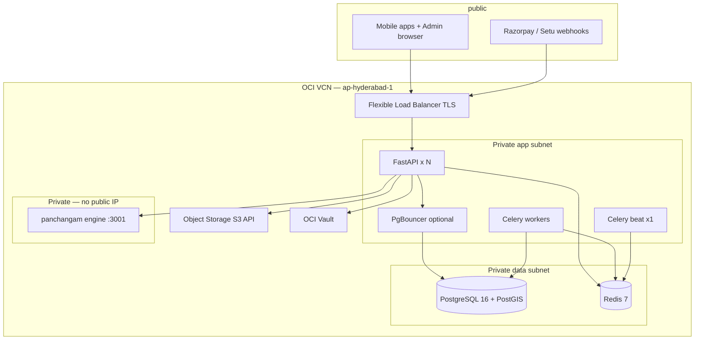

# Oracle Cloud (OCI) deployment plan — ship from laptop to production

**Audience:** Founders / ops shipping **Hyderabad Puja MVP** (`booking_fee`, TDS OFF).  
**Companion:** [`MVP_GO_NO_GO_CHECKLIST.md`](./MVP_GO_NO_GO_CHECKLIST.md) (sign-off) · [`ARCHITECTURE.md`](../ARCHITECTURE.md) (stack rules) · [`PANCHANGAM_OPS.md`](./PANCHANGAM_OPS.md) (private engine node).

**Repo today:** Application is **OCI-ready** (Linux, Postgres+PostGIS, Redis, Celery, S3 API). There is **no** Dockerfile, Terraform, or CI deploy pipeline in-tree — this plan is what you **provision on OCI** and what to **add to the repo** next.

---

## 1. Choose a tier

| | **Tier A — Ship (MVP)** | **Tier B — High-end (recommended at scale)** |
|---|-------------------------|-----------------------------------------------|
| **Goal** | First prod cut, low ops surface | HA API, safe Redis/DB, room for 2+ API pods |
| **API** | 1× Compute VM (4 OCPU / 16 GB) | 2+ VMs or **OKE** pods behind **OCI Load Balancer** |
| **Celery** | Same VM as API (worker + **one** beat) | **Dedicated** worker VM(s); beat on **exactly one** process |
| **PostgreSQL** | 1× Compute VM, PG16 + PostGIS 3, daily backup to Object Storage | **OCI Database for PostgreSQL** *if* PostGIS/btree_gist confirmed **or** PG primary + standby on Compute; **PgBouncer** in transaction mode |
| **Redis** | 1× small VM or single-node OCI Cache | OCI Cache for Redis + replica; AOF persistence |
| **Panchangam** | Optional: same private subnet VM `:3001` | Small private VM; SG allows **only** API subnet → `:3001` |
| **Admin UI** | Build static/Node on VM `:3000` or separate tiny VM | Object Storage + CDN **or** container behind same LB (path/host rule) |
| **Secrets** | OCI Vault + instance principal **or** `.env` on VM (rotate manually) | Vault → inject into instances/containers; no secrets in git |
| **Deploy from laptop** | `git pull` + systemd restart **or** rsync artifact | GitHub Actions → OCIR → rolling update on OKE **or** Ansible |

**Region:** **`ap-hyderabad-1`** (users + Razorpay/Setu latency). Use Mumbai only if Hyderabad capacity/compartment policy requires it.

**Do not use:** Oracle Autonomous Database for this app — backend is **`postgresql+psycopg`** only.

---

## 2. Target architecture (Tier B)

**ARCHITECTURE.md requirements this satisfies:**

- **PostGIS + btree_gist** on Postgres (exclusion constraints).
- **Redis:** presence, Celery broker, sweep locks, WS pub/sub — plan **one** Redis dependency with replica (Tier B).
- **>1 API instance:** only after Redis pub/sub path is live (already in code); LB must support **WebSocket** upgrade to API.
- **PgBouncer transaction mode** before scaling API past one instance (`prepare_threshold=None` on psycopg — see ARCHITECTURE §Connection policy).

---

## 3. OCI service mapping

| Need | OCI service | Notes |
|------|-------------|--------|
| HTTPS API | **Load Balancer** (flexible) + cert (OCI Certificates or Let’s Encrypt on VM) | Health check: `GET /health` |
| Compute | **Compute** (Ampere A1 or AMD) or **OKE** | Python 3.12, systemd or containers |
| Postgres | **Database with PostgreSQL** *or* **Compute + marketplace/custom image** | Confirm `CREATE EXTENSION postgis` + `btree_gist` before committing to managed |
| Redis | **OCI Cache** (Redis-compatible) *or* Compute | Celery + same URL for broker/backend |
| KYC/catalog files | **Object Storage** + **customer secret key** | Set `S3_ENDPOINT_URL` to regional S3-compatible endpoint, `S3_REGION`, buckets private + SSE |
| Secrets | **Vault** | `SECRET_KEY`, Razorpay, Setu, `TOTP_ENC_KEYS`, DB password |
| DNS | **OCI DNS** or registrar CNAME | `api.managuruji.com`, `admin.*` |
| Egress | **NAT gateway** on private subnets | Workers call Razorpay, FCM, SMS, Setu, Maps |
| Backups | Object Storage + **DB PITR** or `pg_dump` cron | ARCHITECTURE §Open items |
| Monitoring | OCI Monitoring alarms + **Sentry** (`SENTRY_DSN`) | Phase 7 Grafana optional later |

---

## 4. Network & security (both tiers)

1. **VCN:** public subnet (LB only) + private subnets (app, data, panchangam).
2. **Security lists / NSGs:**
   - LB → app `:8000` (or nginx `:443` on app nodes).
   - App → Postgres `:5432`, Redis `:6379`.
   - App → panchangam **private IP** `:3001` only.
   - **No** public IP on Postgres, Redis, or panchangam.
3. **Outbound:** NAT for app/workers (FCM, SMS, Razorpay, Setu).
4. **DB role:** Runtime `DATABASE_URL` = **`puja_app`** after [`apply_grants.py`](../../scripts/apply_grants.py); migrations as superuser/`puja_migrate` from laptop or CI job.
5. **Object Storage:** block public buckets; presigned URLs only (app design).

---

## 5. What runs on each host (process list)

Copy-paste from [`celery_app.py`](../../app/workers/celery_app.py) and [`CURSOR_SETUP.md`](../../CURSOR_SETUP.md).

| Process | Command (prod) |
|---------|----------------|
| API | `uvicorn app.main:app --host 0.0.0.0 --port 8000 --workers 2` *(or gunicorn `uvicorn.workers.UvicornWorker`)* |
| Celery worker | `celery -A app.workers.celery_app worker -l info -Q sweep,dispatch,refund,notifications` |
| Celery beat | `celery -A app.workers.celery_app beat -l info` — **single instance globally** |
| Panchangam (optional) | `telugu-panchangam-app` Node `:3001` on private host |
| Admin UI | `npm run build && npm run start` (or export static to Object Storage) |
| Reverse proxy (optional) | Nginx/Caddy on VM for TLS if not terminating at LB |

**Queues:** Missing **beat** = stuck refunds, dispatch TTL, reconfirm, sweep — **P0** on go/no-go checklist.

---

## 6. Environment (prod `.env` on Vault / host)

Minimum set (see [`.env - Copy.example`](../../.env%20-%20Copy.example) + [`TDS_RUNTIME_CONFIG.md`](./TDS_RUNTIME_CONFIG.md)):

| Group | Variables |
|-------|-----------|
| App | `APP_ENV=production`, `DEBUG=false`, `SECRET_KEY`, `ALLOWED_ORIGINS`, `PLATFORM_TIMEZONE=Asia/Kolkata` |
| Data | `DATABASE_URL=postgresql+psycopg://puja_app:…@<pgbouncer or pg>:5432/puja_platform`, `REDIS_URL` |
| Payments | `RAZORPAY_*`, webhook URL in Razorpay dashboard → `https://api…/v1/webhooks/razorpay` |
| SMS | `FAST2SMS_*`, `MSG91_*`, `SMS_PROVIDER_ORDER` — **DLT** before real OTP |
| KYC | `KYC_SETU_*`, `KYC_REDIRECT_URL=https://api…/v1/pujari/kyc/callback` |
| Storage | `S3_ENDPOINT_URL`, `S3_*`, buckets |
| FCM | `FCM_SERVICE_ACCOUNT_PATH=/etc/mana-guruji/firebase-sa.json` |
| Panchangam | `PANCHANGAM_VENDOR_URL=http://<private-ip>:3001/api/panchangam` |
| TDS MVP | `TDS_ACCRUAL_ENABLED=false`, `TDS_ACCEPT_STUB_COLLECT=false`, `FULL_ONLINE_ENABLED=false` |
| Admin | `TOTP_ENC_KEYS` |

Register **public URLs** with Razorpay and Setu before go-live.

---

## 7. Database bootstrap (every new environment)

Run once from laptop or CI jump box with superuser URL — full chain in [`MVP_GO_NO_GO_CHECKLIST.md`](./MVP_GO_NO_GO_CHECKLIST.md) §C:

1. `alembic upgrade head` (001–011).
2. `python scripts/apply_migration_012.py` … `027`.
3. `python scripts/apply_migrations_028_032.py` (028–034).
4. `bootstrap_puja_app_role.py` + `apply_grants.py`.
5. Seed: catalogue / service areas / RM (`bootstrap_catalog.py`, ops scripts).
6. `bootstrap_admin.py`.
7. `python scripts/check_tds_readiness.py --strict` on **clean** DB.

**Every deploy:** `python scripts/apply_grants.py`.

---

## 8. Ship path from your laptop (phased)

### Phase 0 — Staging compartment (1–2 days)

1. Create VCN + Tier A VMs (or single “all-in-one” staging).
2. Install PG16+PostGIS, Redis, Python venv, clone repo, run §7.
3. Point mobile dev builds at staging API (`adb reverse` or staging URL).
4. Run [`MVP_GO_NO_GO_CHECKLIST.md`](./MVP_GO_NO_GO_CHECKLIST.md) A–F on staging.
5. Optional TDS dogfood: [`TDS_STAGING_ROLLOUT.md`](./TDS_STAGING_ROLLOUT.md) only on staging.

### Phase 1 — Production Tier A (MVP go-live)

1. **New prod DB** (never copy staging data wholesale).
2. Repeat migrations + grants + catalog seed + admin bootstrap.
3. Prod `.env` from Vault; `DEBUG=false`.
4. systemd units for `api`, `celery-worker`, `celery-beat` (enable + restart on boot).
5. LB + TLS + DNS; webhook smoke with Razorpay test mode then live.
6. Sign go/no-go checklist.

### Phase 2 — Tier B hardening (post-MVP, pre-festival)

1. Split Celery onto dedicated VM; keep **one** beat.
2. Add second API instance + LB; enable PgBouncer.
3. Move Postgres to managed or replica; automate backup to Object Storage.
4. Private panchangam node + [`PANCHANGAM_OPS.md`](./PANCHANGAM_OPS.md) accuracy gate.
5. OCI alarms: `/health` fail, Redis down, `sweep_age_seconds` high, disk.

### Phase 3 — Repo artifacts (engineering, parallel)

| Artifact | Purpose |
|----------|---------|
| `Dockerfile` (API) + `Dockerfile.worker` | Same image, different CMD (api vs celery) |
| `docker-compose.prod.yml` (reference) | Local parity; not required on OCI if using systemd |
| `deploy/systemd/*.service` | `mana-guruji-api`, `celery-worker`, `celery-beat` |
| `deploy/nginx/api.conf` | WS proxy headers if needed |
| GitHub Actions → **OCIR** → SSH deploy or OKE rollout | Laptop no longer production deploy path |
| Optional: `infra/oci/terraform/` | VCN, LB, instances, buckets — team choice |

---

## 9. Admin & mobile cutover

| Surface | OCI placement |
|---------|----------------|
| **API** | `https://api.<domain>/v1/...` |
| **Admin** | `https://admin.<domain>` → Next.js; `ALLOWED_ORIGINS` on API |
| **Flutter** | Point prod flavor base URL to API; FCM unchanged (Firebase, not OCI) |
| **Webhooks** | Only LB public hostname; no ngrok |

---

## 10. Cost & ops reality (honest)

- **Tier A** can run **~₹15k–40k/month** OCI (single VM + small DB VM + LB + storage) depending on shape — order-of-magnitude only.
- **Tier B** adds LB compute, redundant API, managed cache, backup storage.
- **Largest launch risks** are not OCI: **DLT SMS**, **Razorpay webhook TLS**, **single Celery beat**, **PostGIS on wrong Postgres offering**, and **forgetting migrations 012–034** after Alembic.

---

## 11. Decision summary

| Question | Answer |
|----------|--------|
| Can we ship to OCI from here? | **Yes** — provision Tier A, follow §7–8, complete go/no-go checklist. |
| “High-end” from day one? | **Tier B** — private subnets, LB, split workers, PgBouncer before 2× API, Vault, Object Storage, private panchangam. |
| What’s missing in git? | **IaC + containers + CI** — plan above; app code does not block OCI. |

**Next engineering ticket (suggested):** `P-OCI-TIER-A` — systemd units + staging VM runbook; `P-OCI-TIER-B` — Terraform skeleton + Dockerfile.
