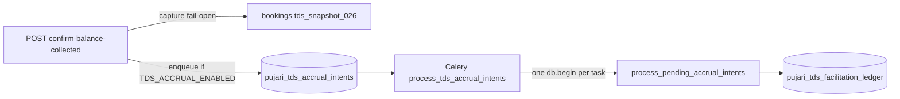

# TDS code review playbook (Sprint 2 backend + admin + DB)

**Purpose:** Adversarial verification map for FastAPI TDS — not launch narrative.  
**Defect IDs / remediations:** only in [`TDS_LAUNCH_STATUS.md`](./TDS_LAUNCH_STATUS.md) §7 (never copy remediation text here).  
**Review runs:** disposable [`reviews/TDS_REVIEW_YYYY-MM-DD.md`](./reviews/) — Pass/Fail per row; link fixes to [`STATUS.md`](./STATUS.md).  
**Runtime knobs:** [`TDS_RUNTIME_CONFIG.md`](./TDS_RUNTIME_CONFIG.md).

**Out of scope (fixes):** Phase 3 withhold/deposit/TAN/`pan_enc` filing (R8 visibility only).  
**Flutter:** defer full UI; grep `mana_guruji_mobile` for `double.parse` / `toDouble()` on tax-summary JSON fields.

---

## 1. Read order

1. [`API_CONTRACTS.md`](../API_CONTRACTS.md) — tax/PAN/admin TDS routes  
2. [`DATABASE.md`](../DATABASE.md) — migrations 025–027  
3. [`PAN_FY_GATES.md`](./PAN_FY_GATES.md)  
4. [`TDS_RUNTIME_CONFIG.md`](./TDS_RUNTIME_CONFIG.md)  
5. [`TDS_LAUNCH_STATUS.md`](./TDS_LAUNCH_STATUS.md) — §5 reversal matrix; §7 IDs **by reference**  
6. This file → run → write dated review under [`reviews/`](./reviews/)

**Fresh-session rule:** Reviewer gets **repo + this file only** — not the plan thread, not §7 as a cheat sheet. New findings → allocate Rn/Dn in §7 (remediation blank) + STATUS fix row.

---

## 2. Architecture (decouple)



| Posture | Falsifier |
|---------|-----------|
| Flag **OFF** | `enqueue_tds_accrual_intent` returns early — **no intent row** |
| Flag **ON** | Confirm 200, worker stopped → intent exists, ledger unchanged until worker runs |
| HTTP path | Must **not** call sync `accrue_*` on confirm (only enqueue + snapshot) |

---

## 3. File map

| Area | Paths |
|------|--------|
| Config | `app/core/config.py`, `app/services/app_config.py` |
| Setu PAN | `app/services/setu_digilocker_client.py`, `pujari_compliance.py`, `partner_onboarding.py` |
| FY gates | `pujari_fy_pan_gate.py`, `offer_service.py`, `pujaris.py`, `service_lifecycle.py` |
| Rates | `app/services/pricing.py` — `load_tds_facilitation_config`, `tds_on_facilitation` |
| Accrual | `tds_accrual_service.py`, `app/workers/tds_accrual.py` |
| Admin | `admin_tds.py`, `admin_tds_compliance.py`, `admin_pujari_fy_report.py`, `admin_ui/.../settings/tds`, `.../fy-earnings` |
| Reversal | `reverse_tds_*` in `tds_accrual_service.py`, `admin_dispute.py`, `admin_tds_compliance.py` |
| Ops | `scripts/check_tds_readiness.py` |

---

## 4. Verification map (by reference to §7)

Columns: **ID | Verify in | What would prove it broken | Reverts test?**

| ID | Verify in | What would prove it broken | Reverts test? |
|----|-----------|----------------------------|---------------|
| D1 | `service_lifecycle.confirm_balance` | Sync `accrue_*` on HTTP path | `test_tds_accrual_decouple` enqueue tests |
| D6 | `tds_accrual.py` + `process_pending_accrual_intents` | One bad intent → txn abort; later intents never ledger; `failed`/`attempt_count` not persisted | y — `test_worker_poison_intent_quarantined_later_intent_accrues` |
| R1 | `reverse_tds_on_cancel` | Reversal skipped when flag off despite accrual row | `test_tds_accrual_decouple::test_reversal_*` (flag false) |
| R4 | Worker ordering | Same pujari intents processed out of `collected_at` order | decouple ordering tests |
| R3 | `_read_fy_row` vs `_lock_fy_row` | Read/preview paths take `FOR UPDATE` on `pujari_tax_year` | y — `test_fy_read_paths_do_not_lock_tax_year` |
| R6 | Refund / cancel paths | Online `booking_fee` refund inserts TDS reversal | grep + integration |
| R15 | `pricing.load_tds_facilitation_config` | Future `effective_from` row changes rate for old `collected_at` | y — `test_accrual_uses_statutory_row_as_of_collected_at`, `test_catch_up_accrual_statutory_as_of_collected_at` |
| R10 | migration 027 backfill + `use_no_pan_tds_rate` | Hash-only pujari at 0.1% without Setu | `test_tds_facilitation_settings` partial |
| R8 | `pujaris.pan_enc` | N/A fix Sprint 2 — empty expected; plaintext PAN in column = fail |

Full ID list: [`TDS_LAUNCH_STATUS.md` §7](./TDS_LAUNCH_STATUS.md).

---

## 5. Migrations 025–027 (checklist)

**025:** ledger, tax year, `pan_hash`, `pan_enc` (P3), `ux_tds_ledger_accrual_per_booking`.

**026:** `tds_snapshot_*`, CHECKs, `ix_bookings_tds_snapshot_missing`, unbounded backfill UPDATE.

**027:** `pan_status` + operative backfill; `tax_statutory_config`; intents table; `ux_tds_accrual_intent_per_booking`; `ix_tds_accrual_intents_pujari_collected`; `ux_tds_ledger_reversal_per_booking`; grants vs `scripts/apply_grants.sql`.

**Pre-flight:** duplicate reversal rows before applying reversal unique index.

---

## 6. Failure modes

### 6.1 Concurrency (R4)

- Per pujari: `ORDER BY collected_at` + plain **`FOR UPDATE`** (no `SKIP LOCKED`).
- Two workers same pujari: **serialize** (B blocks on A) — ordering OK; **PgBouncer pool** pressure under long txns.
- **`processing` status:** in CHECK, **never set in code** — review `parked` / `failed` instead.

### 6.2 Batch transaction scope (D6) — S14 go/no-go

- **One `db.begin()`** wraps entire `process_pending_accrual_intents()` per Celery task (`app/workers/tds_accrual.py`).
- **Bound:** `LIMIT :lim` on **distinct pujari_id** (default 50), **not** on total intent count — one task can process many intents × up to 50 pujaris in **one txn**.
- **Postgres:** DB error inside `_execute_accrual` aborts txn; Python `except` UPDATE for `failed` may not commit (`InFailedSqlTransaction`) without **SAVEPOINT per intent**.
- **Falsifiers:**
  - Insert intent that violates ledger unique / CHECK; run worker; later intents in batch never accrue.
  - After forced failure: `SELECT status, attempt_count, last_error FROM pujari_tds_accrual_intents` — if still `pending/0/null`, quarantine path is broken.
  - Measure batch duration vs pending backlog at flip.

**Fix shape (fix pass):** bounded intents per task, SAVEPOINT per intent, failure rows committed outside batch txn.

### 6.3 Statutory as-of (R15)

- Accrual **rate** math is centralized in `_execute_accrual` (`load_tds_facilitation_config(..., as_of=collected_at)`). All live accrual paths use it: Celery worker (`process_pending_accrual_intents`) and **`accrue_tds_on_balance_collected`** (catch_up / tests).
- Idempotent read helpers (`tds_snapshot_for_booking`, enqueue “already accrued”) return **ledger** amounts — no statutory reload for rate.
- **`fy_reconcile` / `check_tds_readiness` reconcile** compare FY accumulator vs ledger net only — they do **not** call `load_tds_facilitation_config`; they cannot false-positive drift from a future statutory row.
- Falsifier: second statutory row with future `effective_from`; replay old intent / catch_up — wrong rate.

### 6.4 Invariant queries (run on staging pre-S14)

1. `pujari_tax_year.gross_facilitation` vs `SUM(ledger.gross_amount)` per pujari/FY  
2. Bookings with `balance_collected_at` and missing `tds_snapshot_pan_on_file`  
3. Collected bookings with flag ON and no intent row  
4. Intent `completed` without ledger accrual row  

### 6.5 §0.C inputs

| Input | Note |
|-------|------|
| No-PAN exposure @ 5% | `check_tds_readiness.py` uses **float** for `nopan_gross * 0.05` — use **Decimal** for sign-off **or** label output **indicative** |
| R10 backfill | Pre-Setu PANs as `operative` → 0.1% vs 5% in models — decision **re-sign §0.C** if rejected |

### 6.6 Reversal matrix

Exercise all rows in [`TDS_LAUNCH_STATUS.md` §5](./TDS_LAUNCH_STATUS.md). **Online booking_fee refund must not reverse TDS.**

### 6.7 S14 flip checklist

- Dated review run, **no open P0 Fail**  
- Reconcile green  
- Backlog bounded; poison-pill quarantine proven  
- Measured worker batch duration vs pending count  
- Celery TDS queue concurrency documented (pool + txn length)

---

## 7. Admin UI

- No PAN plaintext; amounts as API strings; admin 403 on TDS routes.

---

## 8. Tests

```text
pytest tests/test_setu_pan_verify.py tests/test_pujari_fy_pan_gate.py tests/test_tds_facilitation_settings.py
pytest tests/test_tds_accrual.py tests/test_tds_accrual_decouple.py tests/test_tds_classification_capture.py
pytest tests/test_admin_tds_compliance.py
python scripts/check_tds_readiness.py
```

**S14 gate:** P0 rows (D1, D2, D3, R1, R4, R6, **D6**, **R15**) need a test that **fails if fix reverted**, or signed manual falsifier in review run.

---

## 11. Fix pass (before fresh re-review)

**Do not skip.** Order and deliverables below are pre-conditions for designing D6 correctly and for closing `L-SPRINT-2-TDS-CODE-REVIEW`.

### 11.1 Size the backlog (staging)

Before designing D6 fix, run on staging after a representative OFF-window collection period:

```sql
SELECT COUNT(*) FROM pujari_tds_accrual_intents WHERE status IN ('pending', 'parked');
SELECT pujari_id, COUNT(*) AS n
FROM pujari_tds_accrual_intents WHERE status IN ('pending', 'parked')
GROUP BY pujari_id ORDER BY n DESC LIMIT 20;
```

**Why:** Worker `LIMIT :lim` applies to **distinct pujari_id** (default 50), not intent count. Inner dimension is **unbounded** — active pujaris can carry the whole OFF backlog in **one transaction**. SAVEPOINT fixes correctness quarantine; **per-pujari intent cap** (remainder pending next tick) may still be required for ops at S14.

Record counts in the next `TDS_REVIEW_*.md` or fix PR description.

### 11.2 PR order (separate — D6 first)

| PR | Scope | Why |
|----|--------|-----|
| **1 — D6** | SAVEPOINT per intent and/or smaller batches; **persist** `failed` / `attempt_count` outside aborted subtxn | Changes transaction shape |
| **2 — R15** | Statutory row `effective_from <= collected_at` | Tests must target **post-D6** worker behavior |

Do **not** batch D6 + R15 in one PR.

### 11.3 Reversion tests (primary deliverable)

Tests must **fail if the fix is reverted** (playbook P0 rule).

**D6:**

1. Mid-batch intent that violates a DB constraint (e.g. duplicate accrual / CHECK).
2. Assert **later intents in the same batch** still reach the ledger (or next tick — document which).
3. Assert poison intent has **`status='failed'`**, **`attempt_count >= 1`**, **`last_error` set** after worker run — proves quarantine is not decorative (SAVEPOINT-only fixes that roll back bookkeeping must **fail** this test).

**R15:**

1. Insert second `tax_statutory_config` row with **future** `effective_from` and different rate.
2. Process intent whose `collected_at` is **before** that row.
3. Assert accrual used **rate from row valid at `collected_at`**, not latest global row.

### 11.4 When `L-SPRINT-2-TDS-CODE-REVIEW` → COMPLETED

- **Not** when fix PRs merge.
- **Not** when the 2026-09-14 static self-audit passes.
- **Only** after a **fresh-session** re-review (`TDS_REVIEW_*.md`) with **no open P0 Fail** on the **fixed** codebase.

**Fresh re-review timing:** **After** fix PRs merge, in a **new chat** with repo + this playbook only — reviewer should not be told which two bugs to hunt.

---

## 9. Security / prod

[`TDS_RUNTIME_CONFIG.md`](./TDS_RUNTIME_CONFIG.md) Layer 1; no PAN/secrets in logs; `DEBUG=false` in prod.

---

## 10. New findings process

1. Add row to [`TDS_LAUNCH_STATUS.md` §7](./TDS_LAUNCH_STATUS.md) (ID, one-line, Sev, milestone; remediation empty).  
2. Add [`STATUS.md`](./STATUS.md) fix task IN_PROGRESS.  
3. Record Pass/Fail in [`reviews/TDS_REVIEW_*.md`](./reviews/).  
4. Remediation text in **same PR as code fix**.
